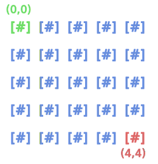
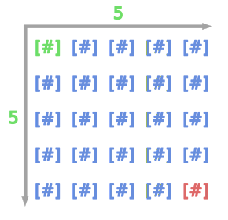
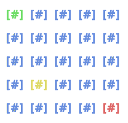

<h1 align="center">
  grid-math
</h1>
<p align="center">
  <a href="https://crates.io/crates/grid-math">
    -FED688?style=for-the-badge">
  </a>
</p>
<h3>
  Rust crate that provides basic representation of Grid, Cell, and assosiated mathematical operations!
</h3>

This crate contains the `Cell` type, representing the basic unit of `Grid`,
the `Grid` type, representing a two-dimentional field of `Cell`s,
the `Cells` type, representing an iterator over every `Cell` on the `Grid`,
the `Rows` and the `Columns` types, representing iterators over subgrids of `Grid`,
and the `GridMap<V>` type, representing a wrapper around the `HashMap<Cell, V>`
<br><br>
One of the best usecases of this crate is for developing `CLI` based games:
`Cell` has two fields representing position on the `Grid`, which are both `u8`,
and the `Grid` consists of the `start` and the `end` `Cell`s,
making the largest possible `Grid` to be 255x255, which is enough for most terminal games.
<br>
```
Note:
- Cell's global position currently represented in the `u8` for simplicity,
  and because this is enough for most terminal games. This may be changed to be a scalar generic in the future.
- Error handling is currently rather stupid (just checks with panic!), but this may change in the future.
- Crate is in the "work in progress" state, so the public API may change in the future. Feel free to contribute!
```
<h3>Examples:</h3>

```rust
use grid_math::{Cell, Grid};

fn main() {
    let grid = Grid::new(5, 5);
    let grid_string = grid
        .rows()
        .map(|row| {
            row.cells()
                .map(|_| " [#]")
                .chain(std::iter::once("\n\n"))
                .collect::<String>()
        })
        .collect::<String>();

    assert_eq!(
        grid_string,
        " \
 [#] [#] [#] [#] [#]

 [#] [#] [#] [#] [#]

 [#] [#] [#] [#] [#]

 [#] [#] [#] [#] [#]

 [#] [#] [#] [#] [#]

"
    );
    println!("{grid_string}");
}
```
This will create, and print out new `Grid`, which has `start` at `(0, 0)` and `end` at `(0, 0)`.<br>

```
Note:
`Grid` has two axis: `width`, and `depth`.When creating `Grid`, `width` and `depth` arguments represent it's length,
but when accessing member (`Cell`) of `Grid`, `width` and `depth` arguments represent relative position (index) of `Cell` on the `Grid`.
```
<br>

`Grid`'s structure has 2 fields: `start: Cell`, and `end: Cell`. Here is a simple diagram, showing 5x5 `Grid` structure:


<br>

`Grid`'s `start` is `(0, 0)`, and `end` is `(4, 4)`, but an actual value of `width` is 5, and `depth` is also 5:


<br>

To perform some actual operations on some `Cell`s, relative to the `Grid`, we can do this:

```rust
use grid_math::{Cell, Grid};

fn main() {
    let grid = Grid::new(5, 5);
    let start = grid.start();
    let next = start.saturating_right(grid, 1).wrapping_down(grid, 8);

    assert!(next.within(grid));
    assert_eq!(next, Cell::new(1, 3));
}
```
<br>

Here is a simple diagram, showing position of `next` cell with color yellow:
<br>

<br>

To store some actual data on the `Grid`, we can use `GridMap<V>` structure, which is a wrapper around the `HashMap<Cell, V>`:

```rust
use grid_math::{Cell, Grid, GridMap};

fn main() {
    let grid = Grid::new(5, 5);
    let mut map: GridMap<char> = GridMap::from(grid);
    map.insert(map.grid().start(), '#');
    map.insert(map.grid().end(), '@');

    assert_eq!(map.len(), 2);
    assert_eq!(map.get(&Cell::new(0, 0)).unwrap(), &'#');
}
```
<br>

The main difference between the `GridMap<V>` and the `HashMap<Cell, V>` is that the `GridMap<V>` has actual bounds, that are defined by the inner `Grid`.
<br>

For more examples, visit `grid-math` documentation on https://docs.rs/grid-math/latest/grid_math/  Crab Crab! 🦀🦀
